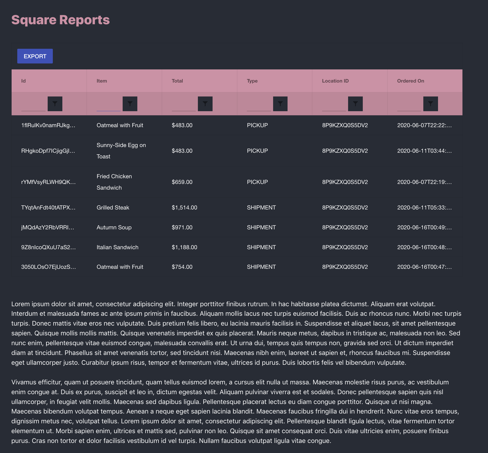
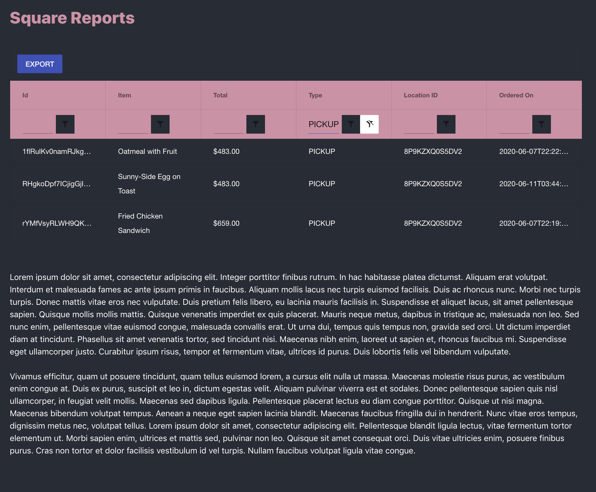
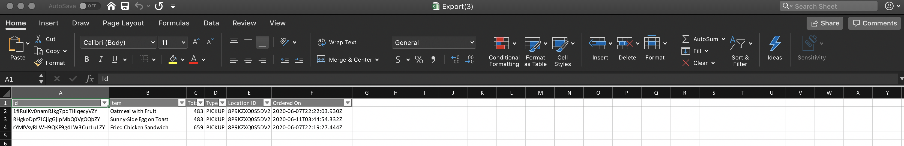

# square-hack
## Dashboard
Many responses in the Square seller community echoed the lack of features in both dashboard reports and the exported Excel file. My hack addresses these issues by implementing Telerik's Kendo UI Grid.

Data is by coding against the Order API. The resulting information is passed into Kendo Grid, with the enabled filtering and sorting available. Filtered states persist even on export--allowing sellers to for example, compile a spreadsheet of all pickup orders.

